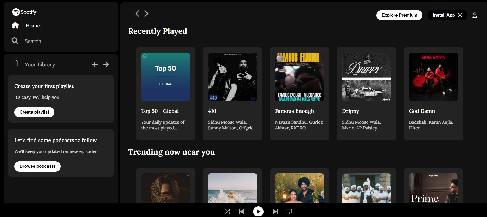

# Spotify Clone

The Spotify front-end clone project aims to recreate the familiar user interface and experience of the popular music streaming platform using only HTML and CSS. This project serves as an excellent opportunity to hone skills in HTML and CSS, while also gaining a deeper understanding of user interface design and layout.

## Technologies Used

- HTML
- CSS

## Features

- Sidebar navigation for easy access to different sections.
- Recently Played section displaying recently listened music.
- Trending Now section showing popular music near the user.
- Featured Charts section showcasing top songs globally and by region.
- Music player with playback controls and progress bar.

## Screenshots

## How to Run

1. Clone the repository.
2. Open the `index.html` file in a web browser.

## Credits

- This project was created by Naonehal Singh.
